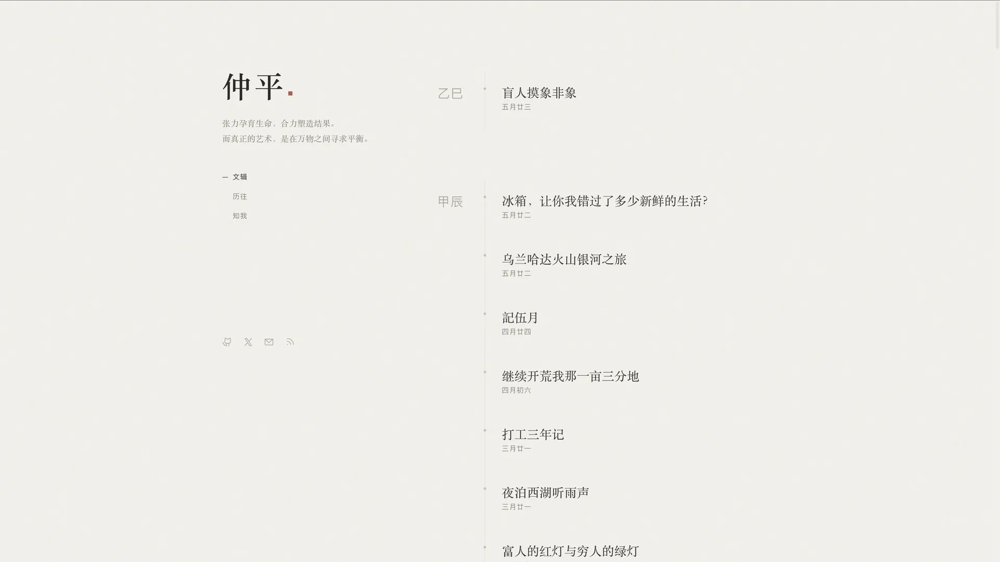

# 文心 (Wenxin) — 文字优先的 Hugo 博客主题


> 文字即界面，留白即设计，克制即力量。

文心是一个极简 Hugo 博客主题，追求极致的阅读体验。专为中文内容设计，同时完整支持英文。

## 预览



## 特性

- **极简设计** — 界面服务于文字，而非抢夺注意力
- **自动暗色模式** — 跟随系统 `prefers-color-scheme`，无需切换按钮
- **完整响应式** — 桌面 / 平板 / 手机三端适配
- **无障碍支持** — WCAG 2.1 AA，键盘友好，屏幕阅读器兼容
- **中文优先** — 天干地支日期、完整 i18n（中英双语）
- **自托管字体** — Lora、EB Garamond、JetBrains Mono（无外部 CDN 依赖）
- **零框架** — 纯 HTML / CSS / ES6+ JavaScript
- **平滑滚动** — Lenis（桌面端）
- **PJAX 导航** — 页面切换无刷新
- **SEO 完整** — Open Graph、Twitter Card、JSON-LD、sitemap、robots.txt
- **多格式 RSS** — RSS 2.0 + Atom + Feed

## 安装

### 方式一：Git Submodule（推荐）

```bash
git submodule add https://github.com/zopiya/wenxin-hugo-theme.git themes/wenxin
```

### 方式二：Hugo Modules

```toml
# hugo.toml
[module]
  [[module.imports]]
    path = "github.com/zopiya/wenxin-hugo-theme"
```

### 方式三：直接下载

从 [Releases](https://github.com/zopiya/wenxin-hugo-theme/releases) 下载并解压到 `themes/wenxin/`。

## 配置

将 `exampleSite/hugo.toml` 复制到项目根目录并按需修改：

```toml
baseURL = "https://example.com/"
languageCode = "zh-CN"
title = "你的博客名"
theme = "wenxin"
defaultContentLanguage = "zh"
hasCJKLanguage = true

[params]
  author      = "你的名字"
  bio         = "你的个人简介"
  description = "站点描述（用于 SEO）"
  readTime    = true
```

### 社交链接

通过 `hugo.toml` 配置，支持任意平台和 [Phosphor 图标](https://phosphoricons.com)：

```toml
[[params.social]]
  icon  = "ph-github-logo"
  url   = "https://github.com/yourname"
  label = "GitHub"
  rel   = "noopener noreferrer"

[[params.social]]
  icon  = "ph-x-logo"
  url   = "https://x.com/yourname"
  label = "Twitter / X"
  rel   = "noopener noreferrer"

[[params.social]]
  icon  = "ph-envelope-simple"
  url   = "mailto:your@email.com"
  label = "发送邮件"
```

RSS 订阅按钮固定显示，无需手动配置。

### 导航菜单

```toml
[menu]
  [[menu.main]]
    identifier = "home"
    name = "文辑"
    url = "/"
    weight = 1
  [[menu.main]]
    identifier = "archive"
    name = "历往"
    url = "/archive/"
    weight = 2
  [[menu.main]]
    identifier = "about"
    name = "知我"
    url = "/about/"
    weight = 3
```

### 统计分析

```toml
[params.analytics.umami]
  websiteId = "your-umami-website-id"
  src       = "https://your-umami-instance/script.js"

# 或 Google Analytics
[params.analytics.google]
  measurementId = "G-XXXXXXXXXX"
```

## 内容结构

```
content/
├── about/
│   └── index.md       # 关于页面（layout: about）
├── archive/
│   └── _index.md      # 归档页面
└── post/
    ├── first-post.md
    └── ...
```

### Front Matter

```yaml
title: "文章标题"
date: 2025-06-18
description: "文章描述（用于 SEO 和社交分享）"
tags: ["标签1", "标签2"]
image: "/images/cover.jpg" # 可选，用于 og:image
```

## 短代码

### Callout 提示块

```markdown

这是一个注意提示。支持 **Markdown**。

```

类型：`note`（默认）/ `tip` / `warning`

### Pull Quote 引言

```markdown

核心观点放在这里。

```

## 自定义

### CSS

创建 `assets/css/custom.css`（主题已预留加载 hook），文件会自动并入 base CSS bundle 末尾，可覆盖所有默认样式：

```css
/* assets/css/custom.css */
:root {
  /* 强调色 */
  --color-accent: #8b3525;
  --color-accent-hover: #a84030;
  --color-accent-subtle: #f5e8e5;

  /* 字体 */
  --font-display: "Lora", serif;
  --font-body: "EB Garamond", serif;
  --font-ui: system-ui, sans-serif;
  --font-mono: "JetBrains Mono", monospace;

  /* 背景 */
  --color-bg-base: #fafaf9;
  --color-bg-warm: #f5f3ef;

  /* 布局宽度 */
  --width-article: 640px;
  --width-content: 760px;
  --width-showcase: 920px;
}
```

暗色模式自动生效，无需额外处理。

### JavaScript

创建 `assets/js/custom.js`（主题已预留加载 hook），文件在所有主题脚本之后加载：

```js
// assets/js/custom.js
// 你的自定义脚本

// ⚠ PJAX 注意事项：
// 主题使用 PJAX 实现无刷新导航，DOM 状态在页面切换后不会保留。
// 事件监听器和库初始化需要在 PJAX 回调中重新执行：
document.addEventListener("pjax:afterPageLoad", function () {
  // 页面切换后重新初始化
});
```

PJAX 在移动端（≤768px）自动禁用，使用完整页面加载。

## 许可

MIT © [Zopiya](https://wenxin.blog)
