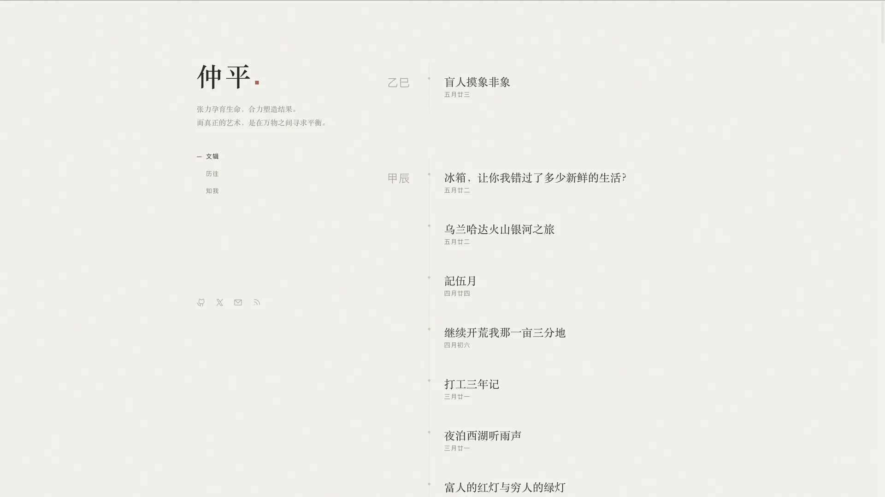

# 文心 (Wenxin) — 文字优先的 Hugo 博客主题


> 文字即界面，留白即设计，克制即力量。

文心是一个极简 Hugo 博客主题，追求极致的阅读体验。专为中文内容设计，同时完整支持英文。

## 预览



## 特性

- **极简设计** — 界面服务于文字，而非抢夺注意力
- **自动暗色模式** — 跟随系统 `prefers-color-scheme`，无需切换按钮
- **完整响应式** — 桌面 / 平板 / 手机三端适配
- **无障碍支持** — WCAG 2.1 AA，键盘友好，屏幕阅读器兼容
- **中文优先** — 天干地支日期（非中文站点自动回退为标准公历）、完整 i18n（中英双语）
- **分层强调排版** — 加粗 / 斜体 / 下划线 / 删除线 / 高亮通过线形（实线、波浪线、点线……）区分层级，强调色只留给少数关键处
- **代码块跟随主题配色** — 语法高亮托管给主题自身而非 Chroma 内置配色方案，自动适配亮 / 暗色模式（需 `noClasses = false`，见 [USAGE.md](USAGE.md#代码高亮)）
- **自托管字体与图标** — Lora、EB Garamond、JetBrains Mono、Phosphor 图标，零外部 CDN 依赖
- **零框架** — 纯 HTML / CSS / ES6+ JavaScript
- **平滑滚动** — Lenis（桌面端）
- **PJAX 导航** — 页面切换无刷新
- **SEO 完整** — Open Graph、Twitter Card、JSON-LD、sitemap、robots.txt
- **RSS 订阅** — RSS 2.0，`<head>` 自动带发现链接

## 安装

### 方式一：Git Submodule（推荐）

```bash
git submodule add https://github.com/zopiya/wenxin-hugo-theme.git themes/wenxin
```

### 方式二：Hugo Modules

```toml
# hugo.toml
[module]
  [[module.imports]]
    path = "github.com/zopiya/wenxin-hugo-theme"
```

### 方式三：直接下载

从 [Releases](https://github.com/zopiya/wenxin-hugo-theme/releases) 下载并解压到 `themes/wenxin/`。

## 快速开始

将 `exampleSite/hugo.toml` 复制到项目根目录，最小可跑的配置只需要几个字段：

```toml
baseURL = "https://example.com/"
title = "你的博客名"
theme = "wenxin"

[params]
  author      = "你的名字"
  bio         = "你的个人简介"
  description = "站点描述"
```

社交链接、统计分析、JSON-LD/PWA、代码高亮要求等完整配置项，见 **[USAGE.md](USAGE.md)**。

## 内容结构

```
content/
├── about/
│   └── index.md       # 关于页面（layout: about）
├── archive/
│   └── _index.md      # 归档页面
└── post/
    ├── first-post.md
    └── ...
```

Front Matter 字段参考、短代码（Callout / Pull Quote）用法见 [USAGE.md](USAGE.md#短代码)。

## 自定义

主题预留了 `assets/css/custom.css` 和 `assets/js/custom.js` 两个 hook，分别在样式和脚本末尾加载，可覆盖任意默认行为，暗色模式自动生效。用法与变量列表见 [USAGE.md](USAGE.md#自定义)。

## 许可

MIT © [仲平 (Zopiya)](https://zopiya.com)
